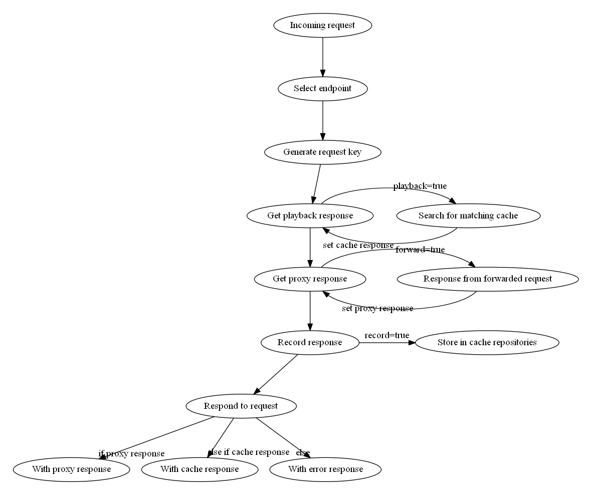

# Nocca
Node mock server


## Description

Use Nocca to serve mocks instead of hitting actual backend servers. Useful for load testing, end-to-end testing, edge-case validations and when you're developing against an unfinished or under-development backend.

Nocca provides a GUI with realtime updates to see what Nocca is serving to your application. There is an HTTP API to control the Nocca server.

## Installing

Nocca can be installed and used as a NodeJS module. Simply run the following command:

```bash
$ npm install --save-dev nocca
```

```javascript
var $nocca = require('nocca');

var nocca = new $nocca({/* options */});
```

This will start the Nocca server on the port (and hostname) specified in the configuration. By default, it is running on localhost:8989. See below on how to configure your instance.

Nocca will start a number of servers:

- GUI (web application): `localhost:8989/gui`
- REST API (allows controlling the instance): `localhost:8989/http-api`
- proxy server (responsible for handling your mock requests): `localhost:8989/proxy`
- websocket (feeds the GUI with realtime data): `localhost:8989/socket`

## Implementation

Implementing Nocca consists of two steps:

1. Setting up your application to talk to Nocca instead of the original services
2. Set up Nocca to respond as desired

### Application setup

Generally the webservices / endpoints that your application calls should be configurable. When running your application through Nocca your application should send the requests to the Nocca proxy server instead. It is then up to Nocca to either serve a cache or forward the request to the original endpoint.

### Nocca setup

For Nocca to work for your application you will need to set application specific configuration properties to your Nocca instance.

#### Server settings

Where you want the Nocca server to run.

```javascript
var $nocca = require('nocca');
var nocca = new $nocca({
    server: process.env.VCAP_APP_PORT || 8989
});
```

Provide a port number, or an array of arguments: `[portNumber, hostname, backlog]`. The array will be applied to the Node.js [`server.listen`](https://nodejs.org/api/http.html#http_server_listen_port_hostname_backlog_callback) function. Nocca will provide the callback argument.

By default it will use the Cloud Foundry port if set, or fall back to `8989`.

#### Endpoints

A Nocca endpoint is a configuration object that is used to handle an incoming request on the Nocca proxy server (`localhost:8989/proxy/*` by default). The object should contain the endpoint URL of the target server, and may contain information on how to create a requestKey, set record/playback/forward flags, etc. 

By default Nocca is configured to use the `endpointSelector` plugin which takes a configuration object. This configuration object defines endpoints as follows:

```javascript
<key>: {
    targetBaseUrl: <url>,
    // additional settings
}
```

Lets work with some examples:

```javascript
var $nocca = require('nocca');
var nocca = new $nocca({
    endpointSelector: ['endpointSelector', {
        google: { // 1
            targetBaseUrl: 'https://www.google.com/com'
        },
        '/googly/ding': { // 2
            targetBaseUrl: 'https://www.google.co.uk/co.uk'
        },
        '/googly/ding/dazzle': { // 2
            targetBaseUrl: 'https://www.google.co.uk/co.uk'
        },
        '/googly/:param/ding': { // 3
            targetBaseUrl: 'https://www.google.co.uk/:param/co.uk/'
        },
        _default: { // 4
            targetBaseUrl: 'https://www.google.nl/nl'
        }
    }]
});
```

##### Selecting an endpoint

The EndpointSelector plugin uses the keys in the configuration object to match against a URL. An endpoint is selected based on the initial path of an incoming request. Let's explain this by taking a look at the above configuration and how it matches incoming requests.

1. Endpoint key `google`: matches the first path part after `/proxy`:
    - Incoming URL `http://localhost:8989/proxy/google/something` selects endpoint `google`
    - The remaining path `/something` is added to `targetBaseUrl` `->` `https://www.google.com/com/something`
2. Endpoint key `/googly/ding`: matches the exact path after `/proxy`:
    - Incoming URL `http://localhost:8989/proxy/googly/ding/dong` selects endpoint `'/googly/ding'`
    - The remaining path `/dong` is added to `targetBaseUrl`
    - Endpoint matching gives priority to the most specific definition. Currently this is based on the length of the key. This impacts endpoint maching as follows:
        - Incoming URL `http://localhost:8989/proxy/googly/ding/dazzle/doo` selects endpoint `'/googly/ding/dazzle'` (instead of `'/googly/ding'`)
        - The remaining path `/doo` is added to `targetBaseUrl`
3. Endpoint key `/googly/:param/ding` dynamically matches the `:param` with any path value not containing a slash:
    - Incoming URL `http://localhost:8989/proxy/googly/some-path-value/ding/doo` selects endpoint `/googly/:param/ding`
    - The remaining path `/doo` is added to `targetBaseUrl`
    - The param can be used in the targetBaseUrl
    - Multiple params may be defined, names must be unique
4. Using a default: a key of `_default` will match any request that was not matched by any of the other endpoint definitions:
    - Incoming URL `http://localhost:8989/proxy/goggle/ding` selects endpoint `'_default'`
    - The full path `/goggle/ding` is added to `targetBaseUrl`

The `targetBaseUrl` property defines the url used to forward requests to, when forwarding is enabled.

View or run `./examples/docs/config-endpoints.js` for an example of this configuration.

##### Overriding configuration for a specific endpoint

Each endpoint can set config properties for incoming requests on that endpoint. This is useful for properties like `keyGenerator`, `record`, `forward` and `responseDelay`.

```javascript
var $nocca = require('nocca');
var nocca = new $nocca({
    // global settings
    record: true,
    forward: true,

    endpointSelector: ['endpointSelector', {
        google: {
            targetBaseUrl: 'https://www.google.com/com'
        },
        '/googly/ding': {
            // disable forwarding for this endpoint
            forward: false,
            targetBaseUrl: 'https://www.google.co.uk/co.uk'
        },
        _default: {
            // disable recording for this endpoint
            record: false,
            targetBaseUrl: 'https://www.google.nl/nl'
        }
    }]
});
```

- The `/googly/ding` endpoint does not forward as it overrides the global `forward` setting
- The `_default` endpoint does not record as it overrides the global `record` setting

View or run `./examples/docs/overriding-endpoint-config.js` for an example of this configuration.

#### Recording

To record you need to use a `cacheRepository`. See the Cache Repositories chapter for more information.

A cache repository can record the answers given on a request to Nocca. To determine whether caches should be recorded, use the `record` property:

```javascript
var $nocca = require('nocca');
var nocca = new $nocca({
    record: true
});
```

When `true` the response message (both when it's served from a cache and when it's returned from the endpoint server) will be recorded in all registered cache repositories. When `false` it won't be.

#### Playback

To replay a cache response you need to use a `cacheRepository`. See the Cache Repositories chapter for more information.

A cache repository can replay the answers given on a request to Nocca. To determine whether caches should be played back, use the `playback` property:

```javascript
var $nocca = require('nocca');
var nocca = new $nocca({
    playback: true
});
```

When `true` the configured cache repositories will be queried in order of configuration to retrieve a cache for an incoming request. If a repository provides a cache, any remaining repositories will not be queried. 

When `false` the cache repositories will not be queried at all.

#### Forwarding

To forward or prevent forwarding an incoming request to an endpoint server, you need to set the `forward` property.

This can be one of the following: `true`, `false`, `'missing'`.

```javascript
var $nocca = require('nocca');
var nocca = new $nocca({
    forward: true
});
```

When `true` any incoming request will be forwarded to the endpoint server. If a cache was previously retrieved using the `playback` property it will be discarded and replaced by the response from th endpoint server.

When `false` the request will never be forwarded.

When `'missing'` the request will only be forwarded when no cache response was found using the `playback` property.

#### Cache Repositories

A response recorded or served by Nocca is called a `cache`. Each cache has a `requestKey` that identifies the cache and allows a cache to be selected as a response. More on request keys in a chapter below.

By default Nocca comes with two of these:

- `cacheConglomerate`
- `cacheQueue`

##### The cache conglomerate

Useful for: fixed responses, static sources, load test responses

- The cacheConglomerate can hold a list of caches and will continue responding to your requests with the cache that matches a calculated request key. 
- It cannot contain duplicate request keys. 
- Additional requests will serve the same cache. 
- As request keys are unique, the order of the caches does not matter.
- The cacheConglomerate will not run out of caches as caches are not removed from the list.

###### HTTP API

You can use the HTTP API to control the repository:

- `GET:/http-api/plugins/cacheConglomerate/caches`
    - Retrieve the current list of stored caches
- `DELETE:/http-api/plugins/cacheConglomerate/caches`
    - Empty the current list of stored caches
- `POST:/http-api/plugins/cacheConglomerate/caches`
    - Add provided list of caches to the current list of stored caches
- `PUT:/http-api/plugins/cacheConglomerate/caches`
    - Replace the current list of stored caches with provided list
- `GET:/http-api/plugins/cacheConglomerate/recorded-caches`
    - Get the current list of recorded caches

##### The cache queue

Useful for: repeated requests with different responses, end to end scenarios (i.e. get profile request, change profile request, get profile request). 

- The cacheQueue can hold a list of caches and serves them in order. 
- After a cache is served it is removed from the list and will not be served again. 
- It can contain duplicate request keys. Additional requests will serve the next cache that matches the request key. 
- The order of the caches determines the order in which they are served: it will serve the first cache that matches the request key. 
- The cacheQueue can run out of caches to serve.

###### HTTP API

You can use the HTTP API to control the repository:

- `GET:/http-api/plugins/cacheQueue/caches`
    - Retrieve the current list of stored caches
- `DELETE:/http-api/plugins/cacheQueue/caches`
    - Empty the current list of stored caches
- `PUT:/http-api/plugins/cacheQueue/caches`
    - Replace the current list of stored caches with provided list
- `GET:/http-api/plugins/cacheQueue/recorded-caches`
    - Get the current list of recorded caches

#### Request keys

A request key is generated by a `keyGenerator`. Nocca is preconfigured with the `cherryPickingKeygen`. 

See its dedicated [documentation file](docs/plugins/cherryPickingKeygen.md).

#### Delaying responses

To delay a response you need a `responseDelay` plugin. Nocca is preconfigured with the `distributedDelay` module.

See its dedicated [documentation file](docs/plugins/distributedDelay.md).

#### Transforming requests and responses

To transform the contents of a request or response you need a `messageTransformer`. This can be useful to patch timestamps in a cache. Nocca includes a `simpleMessageTransformer` module. 

See its dedicated [documentation file](docs/plugins/simpleMessageTransformer.md).

#### Log settings

Nocca is configured with a Bunyan logger that logs to your console. You can change the application name and log level. The level of logging should be one of: `fatal`, `error`, `warn`, `info`, `debug`, `trace`. The logger will log that level and higher (i.e. 'info' would also log 'error' events, but not 'debug' events).

```javascript
var $nocca = require('nocca');
var nocca = new $nocca({
    logger: {
        name: 'Nocca',
        level: 'info'
    },
});
```

# Under the hood

## Flow


